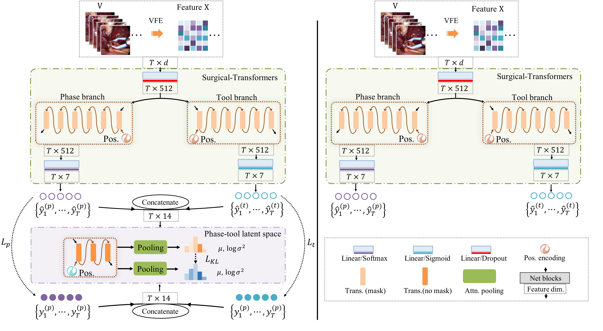

The code repository for "[LAST:LAtent Space-constrainted Transformers for Automatic Surgical Phase Recognition and Tool Presence Detection]" (Accepted by TMI) in PyTorch. 

Rong Tao, Member, IEEE, Xiaoyang Zou, and Guoyan Zheng*, Member, IEEE

*corresponding author

Institute of Medical Robotics,
School of Biomedical Engineering,
Shanghai Jiao Tong University

## Main idea of LAST 

When developing context-aware systems, automatic surgical phase recognition and tool presence detection are two essential tasks. There exist previous attempts to develop methods for both tasks but majority of the existing methods utilize a frame-level loss function (e.g., cross-entropy) which does not fully leverage
the underlying semantic structure of a surgery, leading to sub-optimal results. In this paper, we propose multi-task learning-based, LAtent Space-constrained Transformers, referred as LAST, for automatic surgical phase recognition and tool presence detection. Our design features a two-branch transformer architecture with a novel and generic way to leverage video-level semantic information during network training. This is done by learning a non-linear compact presentation of the underlying semantic structure information of surgical videos through a transformer variational autoencoder (VAE) and by encouraging network predictions to follow the learned statistical distributions. In other words, LAST is of structure-aware and favors predictions that lie on the extracted low dimensional data manifold.

## Results

Experimental results on the Cholec80 dataset (half-half split, first half train, next half test). 

**Cholec80 Dataset**
|          |                      Phase               |    Tool  |
|  Methods | Accuracey | Precision | Recall | Jaccard |    mAP   |
|:--------:|:---------:|:---------:|:------:|:-------:|:--------:|
| Endonet  |81.70±4.20 |73.70±16.10|79.60±7.90|    -  |76.30±5.10|
| SV-RCNet |85.30±7.30 |80.70±7.00 |83.50±7.50|    -  |    -     |
|   LRTD   |85.73±6.69 |82.94±6.20 |85.04±5.15|    -  |    -     |
|MTRCNet-CL|89.20±7.60 |86.90±4.30 |88.00±6.90|    -  |89.10±7.00|
|   TeCNO  |88.56±0.27 |81.64±0.41 |85.24±1.06|    -  |    -     |
|   TMRNet |90.10±7.60 |90.30±3.30 |89.50±5.00|79.10±5.70|    -  |
|   OperA  |90.22±6.06 |84.19±7.38 |85.47±6.41|73.03±9.58|   -   |  
|Trans-SVNet|90.30±7.00|90.80±4.90 |88.50±7.20|79.00±7.80|   -  | 
|   Ours  |93.12±4.71|89.25±5.49|90.10±5.45|81.11±7.62|95.15±3.87| 

Experimental results on the M2CAI dataset (data split is the same as the challenge). 

**M2CAI Dataset**

**Phase**
|     Methods      | Accuracey | Precision | Recall | Jaccard |
|:----------------:|:---------:|:---------:|:------:|:-------:|
|Dergachyova et al.|70.7±6.1   |-|-|51.5±14.1|
|Twinanda et al.   |79.5±12.1  |-|-|64.1±10.3|
|Cadene et al.     |86.9±11.0  |-|-|71.9±12.7|
|Jin et al. 2018   |81.7±8.1   |81.0±8.3   |81.6±7.2|65.4±8.9 |
|Jin et al. 2021   |87.0±8.6   |87.8±6.9   |88.4±5.3|75.1±6.9 |
|Gao et al.        |87.2±9.3   |88.0±6.7   |87.5±5.5|74.7±7.7 |
|Ours (VFE only)   |81.5±4.8   |73.9±4.3   |79.9±4.5|62.0±4.8 |
|Ours (VFE+FE+LSC) |91.5±5.6   |86.3±7.5   |88.7±7.3|77.8±10.1|

**Tool**
|     Methods      |      mAP  |
|:----------------:|:---------:|
|STGCN (3D DenseNet + GCNs)|90.2|
|AGNet             |86.8  |
|EndoNet           |52.5|
|Ours (VFE only)   |90.0|
|Ours (VFE+FE+LSC) |93.4|

## We also provide video features, stage-1 model and stage-2 model for the Cholec80 dataset.

- Stage-1 training the VFE:

- Path to stage1 model: (https://www.dropbox.com/scl/fo/eo7wiux09wmgeecat1vx9/h?dl=0&rlkey=6gz3k7268c8pn4bsxxa98pfro) 

- Path to preprocessed label file (.pickle) for the Cholec80 dataset  https://pan.baidu.com/s/1eAeoA0UUsj7FIqDz2g9RMg?pwd=0000 

- Stage-2 training the LAST:

- Path to stage2 model: (https://www.dropbox.com/scl/fo/eo7wiux09wmgeecat1vx9/h?dl=0&rlkey=6gz3k7268c8pn4bsxxa98pfro) 

- Path to video feature files from stage 1 model: (https://www.dropbox.com/scl/fo/eo7wiux09wmgeecat1vx9/h?dl=0&rlkey=6gz3k7268c8pn4bsxxa98pfro) 

## Prerequisites

The following packages are required to run the scripts:

- [PyTorch-1.6 and torchvision](https://pytorch.org)

- Package: numpy, sklearn, timm, apex

## Dataset

### Cholec80 Dataset

The Cholec80 dataset contains 80 videos of cholecystectomy surgeries performed by 13 surgeons. The videos are captured at 25 fps. The dataset is labeled with the phase (at 25 fps) and tool presence annotations (at 1 fps). (http://camma.u-strasbg.fr/datasets)

### M2CAI Dataset

These datasets were generated for the M2CAI challenges, a satellite event of MICCAI 2016 in Athens. Two datasets are available for two different challenges: m2cai16-workflow for the surgical workflow challenge and m2cai16-tool for the surgical tool detection challenge. Some of the videos are taken from the Cholec80 dataset. (http://camma.u-strasbg.fr/datasets)

## Code Structures
To reproduce our experiments with LAST, please use **train_stage1.py**,  **train_stage2.py**.
 - `models`: It contains the main files of the code, including the few-shot learning trainer, the dataloader, the network architectures, and baseline and comparison models.
 - `dataset`: Data loaders and splits for the data sets.
 - `*engine*.py`: train or inference loop
 - `train*.py, inference*.py`: train or inference files

## Model Training and Evaluation
Please use**train_stage1.py** to train the VFE, and **train_stage2.py** to train LAST and follow the instructions below. 

## preprocess
The **preprocess_video2npy_multiprocessing.py** takes the following options:

- `data_path`: Path to .mp4 videos

- `out_png`: Path to proprocessed .npy files

## Train-VFE
The **train_stage1.py** takes the following options:

- `batch_size`: default to `150`

- `epochs_init`: use train-val split as 32-8 to obtain the optimum training epoch: T-opt, default to `10`

- `epochs_finetune` (optional): use to entire training set (40 videos) to finetune the network for T-opt epochs, default to `10`

- `data_path`: Path to preprocessed npy files

- `output_dir`: Path to save weight file/ log files

- `resume`: Path to pretrained weights

## Inference-VFE, save features for stage-2
The **inference_stage1_savefeature.py** takes the following options:

- `batch_size`: always be `1` video

- `data_path`: Path to preprocessed npy files

- `output_dir`: Path to save weight file/ log files

- `resume`: Path to pretrained weights

## Train-LAST
The **train_stage2.py** takes the following options:

- `batch_size`: always be `1`

- `epochs_init`: use train-val split as 32-8 to obtain the optimum training epoch: T-opt, default to `10`

- `epochs_finetune` (optional): use to entire training set (40 videos) to finetune the network for T-opt epochs, default to `10`

- `data_path`: Path to video feature npy files

- `output_dir`: Path to save weight file/ log files

- `resume`: Path to pretrained weights

## Inference-LAST
The **inference_stage2.py** takes the following options:
    
- `batch_size`: always be `1` video

- `data_path`: Path to video feature npy files

- `output_dir`: Path to save weight file/ log files

- `resume`: Path to pretrained weights

